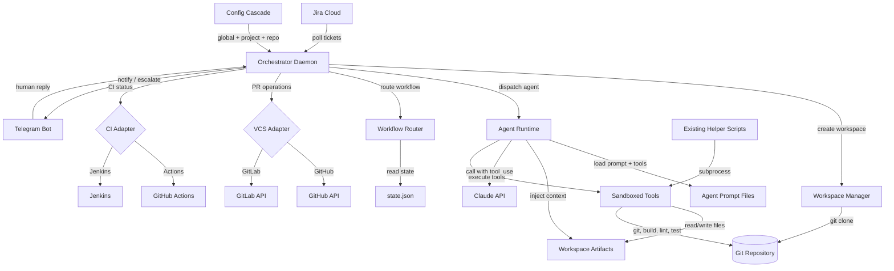
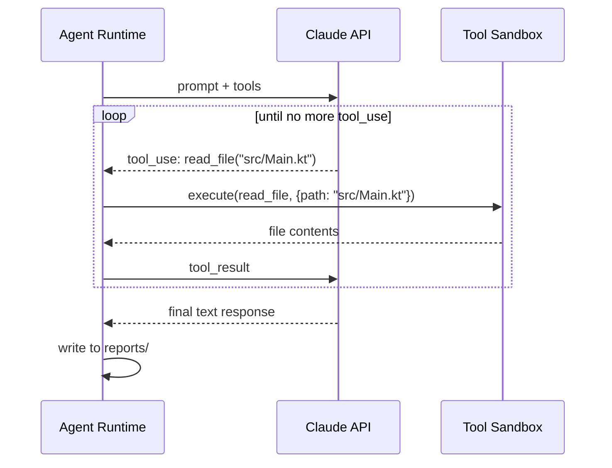
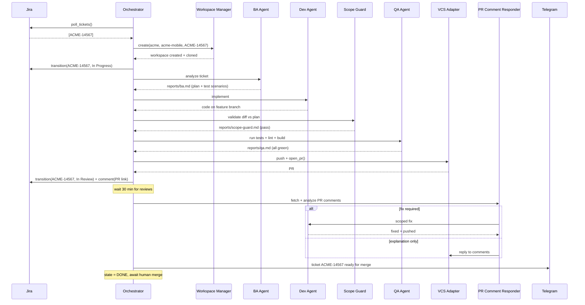
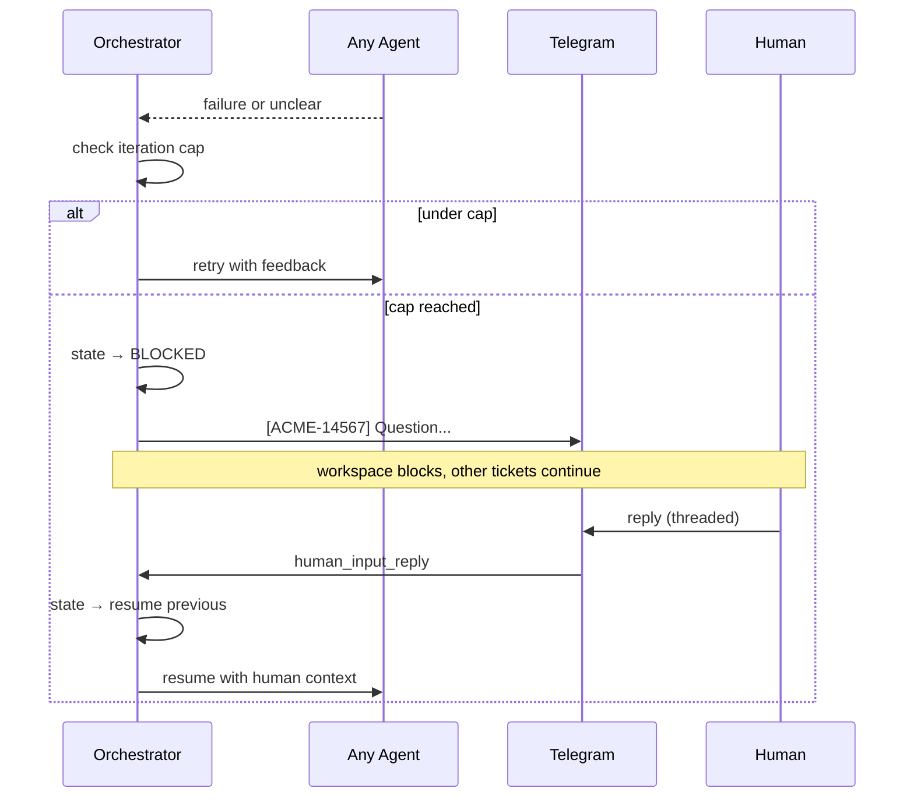

# Sickle — Architecture Document v2

## Introduction

This document is the definitive system architecture for Sickle — an autonomous Jira-driven development system (AJDS). It merges the original Sickle architecture with the AJDS RFC and incorporates decisions made during the 2026-04-08 architecture review session.

This document supersedes `architecture.md` (v1). All implementation work references this document.

### Change Log

| Date | Version | Description | Author |
|:-----|:--------|:------------|:-------|
| 2026-03-28 | 1.0 | Initial architecture | Winston / Oleksandr |
| 2026-03-28 | 1.1 | Checklist gaps, LLM adapter, health heartbeat | Winston / Oleksandr |
| 2026-04-08 | 2.0 | Merged architecture — RFC integration, multi-company, GitLab support, new pipeline, agent tool_use | Winston / Oleksandr |

---

## 1. Goals

- Pipeline autonomously takes a Jira ticket from "To Do" to open PR without human involvement in the happy path
- Merge is a human decision — the system does not merge PRs
- Single daemon manages multiple companies, projects, and repositories via config
- Runs 24/7 on a cloud VPS, polls continuously, survives restarts via idempotent state
- Enforces architecture rules, lint gates, test coverage, and scope discipline
- When stuck, asks precise questions via Telegram and resumes on reply
- All configuration in YAML with 3-level cascade (global → project → repo)
- BMAD-style agent architecture — agents are pluggable prompt files with declared tool access
- Supports both GitHub and GitLab as VCS platforms
- Supports both GitHub Actions and Jenkins as CI systems
- Ticket history and agent reports persist indefinitely; only source code is cleaned up after merge

### Non-Goals

- Full autonomy without human control (human remains fallback)
- Replacing CI/CD (integrates with, does not replace)
- Merging PRs (human responsibility)
- Database — all state is filesystem-based

---

## 2. High-Level Architecture

### Technical Summary

Sickle is a modular monolith Python daemon that orchestrates autonomous software development. The system follows an **event-loop + agent dispatch** architecture: a single persistent orchestrator polls for work, manages isolated workspaces, and dispatches BMAD-style AI agents via Claude API with tool_use (function calling). All inter-agent communication is file-based (workspace artifacts). All state is on disk (`state.json`). All external integrations are behind abstract adapter interfaces supporting multiple providers (GitHub/GitLab, GitHub Actions/Jenkins, Jira, Telegram).

### Architecture Diagram



### Architectural Patterns

| Pattern | Usage | Rationale |
|---------|-------|-----------|
| **Orchestrator** | Central coordinator dispatches agents | Agents don't know about each other; centralized state |
| **Adapter (Ports & Adapters)** | Abstract interfaces for VCS, CI, tracker, notifier | Swap GitHub↔GitLab, Actions↔Jenkins without touching pipeline |
| **File-Based IPC** | Agents communicate via workspace artifacts | Enables idempotent restart from disk |
| **State Machine** | Each workspace progresses through defined states | Explicit states; disk persistence enables crash recovery |
| **BMAD Agent** | Agents as prompt files with metadata + tool declarations | New agents = new files, zero code changes |
| **Template Method** | Agent runtime: load → inject → call LLM → execute tools → write output → log | Consistent execution across all agents |
| **Tool Use (Function Calling)** | Agents execute side effects via declared tools | Sandboxed, auditable, per-agent tool allowlists |

---

## 3. Directory & Data Model

### 3.1 Workspace Hierarchy

```
/<base_dir>/                              # Configurable base (e.g., /data/)
  /<company>/                             # e.g., Acme, BetaCo
    /<repo>/                              # e.g., Acme Mobile, BetaApp
      /rules/                             # Repo-specific rules (arch-rules.md, etc.)
      /tickets/
        /<ticket_id>/                     # e.g., ACME-14567
          /meta/
            ticket.md                     # Jira ticket (markdown)
            parent.md                     # Parent ticket context (if exists)
            history.md                    # Ticket change history
            comments.md                   # Jira comments
            diff_log.json                 # Reopen/change tracking
          /reports/
            ba.md                         # BA agent report
            pm.md                         # PM agent report
            developer.md                  # Dev agent output
            scope-guard.md                # Scope validation result
            qa.md                         # QA report
            pr-comments.md                # PR comment analysis
          /state.json                     # Pipeline state machine
          /source/                        # Git clone (deleted after merge via CI hook)
            /.git/
            /...                          # Full repo contents
          /logs/
            ba-agent.log                  # Per-agent execution logs
            dev-agent.log
            ...
```

### 3.2 Key Design Decisions

- **Ticket-centric organization**: The ticket folder is the unit of work. Everything related to one ticket lives in one directory.
- **Markdown artifacts**: All ticket data and agent reports are markdown (`.md`), not JSON. AI-friendly, human-readable, diff-friendly.
- **`state.json` is the only JSON**: Machine-read state that needs structured parsing.
- **`/source/` is ephemeral**: Deleted after merge. Everything else persists for history.
- **`/rules/` is per-repo**: Architecture rules, coding standards, protected file lists. Shared across all tickets in that repo.
- **Company = config-level grouping**: Not a filesystem entity that the pipeline creates — it's the top-level directory under base_dir, mapped from project config.

### 3.3 State Machine

```
NEW → ANALYSIS → DEV → SCOPE_CHECK → QA → PUSHED → PR_REVIEW → DONE
                  ↑         |                          |
                  └─────────┘ (scope violations)       |
                  ↑                                    |
                  └────────────────────────────────────┘ (fix required)

Any stage → BLOCKED (awaiting human)
BLOCKED → (resume previous stage)

Any active stage → AWAITING_APPROVAL (operator gate)
AWAITING_APPROVAL → (resume previous stage)

Any active stage → MANUAL_CONTROL (operator takes control)
MANUAL_CONTROL → ANALYSIS (release control)

Any stage → FAILED (unrecoverable)
DONE → ARCHIVED (source cleanup)
```

**State definitions:**

| State | Meaning |
|-------|---------|
| `NEW` | Ticket fetched, workspace created, not yet processed |
| `ANALYSIS` | BA/PM agents evaluating the ticket |
| `DEV` | Developer agent writing code |
| `SCOPE_CHECK` | Scope Guard validating diff against plan |
| `QA` | QA agent running tests, lint, build |
| `PUSHED` | Code pushed, PR opened, waiting for review |
| `PR_REVIEW` | PR Comment Responder processing review comments |
| `DONE` | All stages complete, PR open and ready for human merge |
| `BLOCKED` | Waiting for human input via Telegram |
| `FAILED` | Unrecoverable error, human intervention needed |
| `AWAITING_APPROVAL` | Pipeline paused, waiting for operator approval to continue |
| `MANUAL_CONTROL` | Operator has taken control, pipeline paused, Claude Code session active |
| `ARCHIVED` | Source code deleted after merge (ticket artifacts remain) |

**Valid transitions:**

```python
VALID_TRANSITIONS = {
    "NEW":                {"ANALYSIS", "FAILED"},
    "ANALYSIS":           {"DEV", "BLOCKED", "FAILED", "AWAITING_APPROVAL", "MANUAL_CONTROL"},
    "DEV":                {"SCOPE_CHECK", "BLOCKED", "FAILED", "AWAITING_APPROVAL", "MANUAL_CONTROL"},
    "SCOPE_CHECK":        {"QA", "DEV", "BLOCKED", "FAILED", "AWAITING_APPROVAL", "MANUAL_CONTROL"},
    "QA":                 {"PUSHED", "DEV", "BLOCKED", "FAILED", "AWAITING_APPROVAL", "MANUAL_CONTROL"},
    "PUSHED":             {"PR_REVIEW", "BLOCKED", "FAILED", "AWAITING_APPROVAL", "MANUAL_CONTROL"},
    "PR_REVIEW":          {"DEV", "DONE", "BLOCKED", "FAILED", "AWAITING_APPROVAL", "MANUAL_CONTROL"},
    "DONE":               {"ARCHIVED"},
    "BLOCKED":            {"ANALYSIS", "DEV", "SCOPE_CHECK", "QA", "PUSHED", "PR_REVIEW", "FAILED"},
    "FAILED":             set(),  # terminal
    "ARCHIVED":           set(),  # terminal
    "AWAITING_APPROVAL":  {"ANALYSIS", "DEV", "SCOPE_CHECK", "QA", "PUSHED", "PR_REVIEW", "DONE", "FAILED", "MANUAL_CONTROL"},
    "MANUAL_CONTROL":     {"ANALYSIS"},  # release control → back to ANALYSIS
}
```

### 3.4 WorkspaceState (`state.json`)

```json
{
  "ticket_id": "ACME-14567",
  "company_id": "acme",
  "repo_id": "acme-mobile",
  "workspace_root": "/data/acme/acme-mobile/tickets/ACME-14567",
  "branch": "feature/ACME-14567-add-login-screen",
  "pr_number": null,
  "pr_url": null,
  "current_state": "DEV",
  "previous_state": "ANALYSIS",
  "stage_iterations": {"DEV": 1, "SCOPE_CHECK": 0},
  "human_input_pending": false,
  "human_input_question": null,
  "human_input_reply": null,
  "manual_control_started_at": null,
  "manual_control_comment": null,
  "started_at": "2026-04-08T10:00:00Z",
  "last_updated_at": "2026-04-08T10:30:00Z",
  "error": null
}
```

---

## 4. Configuration

### 4.1 Three-Level Cascade

```
global.yaml → project.yaml → repo.yaml
```

Lower-level values override higher-level. Unset fields inherit from parent. All secrets via `${ENV_VAR}` references resolved at load time.

### 4.2 Global Config (`global.yaml`)

```yaml
operator:
  role: "Team Lead & KMP Developer"
  stack: [kotlin, android, kmp, compose]
  preferences:
    commit_style: "conventional"
  rules:
    - "Never modify architecture rules files"
    - "No bonus refactoring outside ticket scope"

telegram:
  bot_token: "${TELEGRAM_BOT_TOKEN}"
  default_chat_id: "${TELEGRAM_CHAT_ID}"

claude:
  api_key: "${CLAUDE_API_KEY}"
  model: "claude-sonnet-4-5"

workspaces:
  base_dir: "/data"
  min_free_disk_gb: 5
  max_workspace_size_gb: 2

defaults:
  poll_interval_seconds: 300
  max_iterations:
    scope_guard: 3
    fix: 3
    qa: 2
    dev: 2
  pr_comment_fetch_delay_minutes: 30

logging:
  level: "INFO"
  dir: "/var/log/sickle"

heartbeat:
  enabled: true
  interval_hours: 24
```

### 4.3 Project Config (`projects/<company>/project.yaml`)

```yaml
project:
  id: "acme"
  name: "Acme Corp"
  enabled: true

jira:
  url: "https://acme.atlassian.net"
  token: "${JIRA_TOKEN_ACME}"
  email: "${JIRA_EMAIL_ACME}"
  project_key: "ACME"
  trigger_label: "ai-pipeline"
  ignore_labels: ["manual-only", "blocked"]
  statuses:
    todo: "To Do"
    in_progress: "In Progress"
    in_review: "In Review"
    done: "Done"

telegram:
  chat_id: "${TELEGRAM_CHAT_ACME}"

parallelism:
  max_concurrent_tickets: 5
```

### 4.4 Repo Config (`projects/<company>/repos/<repo>.yaml`)

```yaml
repo:
  id: "acme-mobile"
  name: "Acme Mobile Mobile"
  enabled: true

vcs:
  provider: "github"               # or "gitlab"
  # GitHub-specific
  github:
    token: "${GITHUB_TOKEN_ACME}"
    owner: "acme-orgcation"
    repo: "acme-mobile"
    default_branch: "develop"
    branch_prefix: "feature"
  # GitLab-specific (alternative)
  # gitlab:
  #   token: "${GITLAB_TOKEN}"
  #   project_id: 12345
  #   default_branch: "develop"
  #   branch_prefix: "feature"

ci:
  provider: "github_actions"        # or "jenkins"
  # Jenkins-specific (alternative)
  # jenkins:
  #   url: "https://jenkins.example.com"
  #   job_key: "compose-plugin"

git:
  clone_url: "git@github.com:acme-orgcation/acme-mobile.git"
  depth: 1                          # shallow clone (0 = full)
  commit_author_name: "Sickle Bot"
  commit_author_email: "sickle@acme.com"

architecture:
  rules_file: "arch-rules.md"      # relative to /rules/
  protected_files:
    - "arch-rules.md"
    - ".github/workflows/*"
    - "*.gradle.kts"

linting:
  run_command: "./gradlew lint"
  hard_gate: true

testing:
  run_command: "./gradlew test"
  hard_gate: true

build:
  check_command: "./gradlew assembleDebug"
  hard_gate: true

jira_repo_label: "android"          # routes tickets to this repo
pr_description_template: |
  ## {ticket_id}: {summary}
  
  {description}
  
  ### Changes
  {change_summary}
  
  ### Test Plan
  {test_scenarios}

# Existing helper scripts (wrapped as subprocesses)
helpers:
  fetch_pr_comments: "/opt/sickle-helpers/pr_comments/fetch_pr_comments.py"
  resolve_pr_comments: "/opt/sickle-helpers/pr_comments/resolve_pr_comments.py"
  fetch_ci_failure: "/opt/sickle-helpers/ci_failures/fetch_ci_failure.py"
  fetch_jira_tickets: "/opt/sickle-helpers/jira_tickets/fetch_jira_tickets.py"
  update_jira_status: "/opt/sickle-helpers/jira_tickets/update_jira_status.py"
```

---

## 5. Tech Stack

| Category | Technology | Version | Purpose |
|:---------|:-----------|:--------|:--------|
| **Language** | Python | 3.12+ | Primary language |
| **Async** | asyncio | stdlib | Concurrent workspace management |
| **Config** | PyYAML | 6.0.2 | YAML config files |
| **HTTP Client** | httpx | 0.28.1 | Jira, GitHub, GitLab API calls |
| **Telegram** | python-telegram-bot | 21.10 | Telegram bot (async polling) |
| **AI SDK** | anthropic | 0.42.0+ | Claude API with tool_use |
| **Git** | subprocess + git CLI | system | Clone, branch, commit, push |
| **Testing** | pytest + pytest-asyncio | 8.3+ | Unit and integration tests |
| **HTTP Mocking** | respx | 0.22.0 | Mock httpx in tests |
| **Linting** | ruff | latest | Code linting |
| **Deployment** | systemd | system | Daemon management |

**No external dependencies for helper scripts** — they use stdlib only (urllib, json, pathlib).

---

## 6. Components

### 6.1 Orchestrator (`orchestrator/orchestrator.py`)

Central daemon loop — polls for tickets, manages slots, spawns workspaces, advances active workspaces through the pipeline.

**Responsibilities:**
- Main async event loop on configurable `poll_interval_seconds`
- Each cycle: poll Jira → check new tickets → check slot availability → spawn workspaces → advance active workspaces
- Workspace-level exception isolation (one failure doesn't crash daemon)
- Graceful shutdown on SIGTERM/SIGINT
- Health heartbeat via Telegram

**Key Interface:**
```python
class Orchestrator:
    async def run() -> None                           # Main loop
    async def poll_cycle() -> None                    # Single cycle
    async def advance_workspace(ws: Workspace) -> None # Invoke next agent
    def shutdown() -> None                            # Graceful stop
```

**Dependencies:** All other components (WorkspaceManager, AgentRuntime, WorkflowRouter, all adapters).

### 6.2 Workflow Router (`orchestrator/workflow_router.py`)

Determines which agent/action to invoke next based on workspace state and workflow definition.

**Key Interface:**
```python
def load_workflow(path: str) -> WorkflowDefinition
def get_next_stage(current: str, workflow: WorkflowDefinition, outcome: str = "default") -> str | None
def should_escalate(stage: str, workflow: WorkflowDefinition, iterations: int) -> bool
```

**Workflow definition** (`workflows/default-workflow.yaml`):
```yaml
stages:
  - id: "analysis"
    agent: "ba-agent"
    next: "dev"
    on_unclear: "escalate"

  - id: "dev"
    agent: "dev-agent"
    next: "scope_check"

  - id: "scope_check"
    agent: "scope-guard-agent"
    on_pass: "qa"
    on_fail: "dev"
    max_iterations: 3
    on_max_iterations: "escalate"

  - id: "qa"
    agent: "qa-agent"
    on_pass: "push"
    on_fail: "dev"
    max_iterations: 2
    on_max_iterations: "escalate"

  - id: "push"
    action: "push_and_open_pr"
    next: "pr_review"

  - id: "pr_review"
    action: "fetch_pr_comments"
    delay_minutes: 30
    on_fix_required: "dev"
    on_done: "done"
    max_iterations: 3
    on_max_iterations: "escalate"

  - id: "escalate"
    action: "notify_human"
    on_reply: "resume_previous"

  - id: "done"
    action: "finalize"
```

### 6.3 Agent Runtime (`orchestrator/agent_runtime.py`)

Loads agent prompt files, assembles context with workspace artifacts, calls Claude API with tool_use, executes tool calls in sandbox, writes output.

**Key Interface:**
```python
class AgentRuntime:
    def assemble_prompt(agent: AgentEntry, workspace: Workspace) -> str
    def get_tools_for_agent(agent_id: str) -> list[ToolDefinition]
    async def execute(agent_id: str, workspace: Workspace) -> AgentResult

@dataclass
class AgentResult:
    agent_id: str
    success: bool
    output: str
    input_tokens: int
    output_tokens: int
    duration_seconds: float
    error: str | None
```

**Execution flow:**
1. Load agent metadata from registry
2. Assemble prompt: agent body + workspace artifacts + operator profile + safety rules
3. Resolve tool allowlist for this agent
4. Call Claude API with `tools=` parameter (function calling)
5. For each tool_use in response: validate against allowlist → execute in sandbox → return result
6. Loop until agent produces final text response (or max tool rounds)
7. Write agent output to `reports/<agent>.md`
8. Log execution to `logs/<agent>.log`

### 6.4 Tool Sandbox (`orchestrator/tool_sandbox.py`)

Executes tool calls from agents within a restricted environment.

**Available tools:**

| Tool | Description | Allowed agents |
|------|-------------|----------------|
| `read_file` | Read a file from workspace source or context | All |
| `write_file` | Write/modify a file in workspace source | dev, fix, qa |
| `list_directory` | List directory contents | All |
| `run_command` | Execute shell command in workspace source dir | dev, qa, fix |
| `git_operation` | Git commands (branch, add, commit) | dev, fix, qa |
| `search_code` | Search/grep across workspace source | All |

**Sandbox rules:**
- All file operations restricted to workspace directory (`/tickets/<id>/source/` and `/tickets/<id>/reports/`)
- `run_command` is restricted to workspace source dir as CWD
- No network access from tools (LLM has network, tools don't)
- Protected files (from config `architecture.protected_files`) cannot be written
- Every tool call is logged to agent's log file

**Tool definition format (for Claude API):**
```python
TOOL_READ_FILE = {
    "name": "read_file",
    "description": "Read the contents of a file in the workspace",
    "input_schema": {
        "type": "object",
        "properties": {
            "path": {
                "type": "string",
                "description": "Relative path from workspace source root"
            }
        },
        "required": ["path"]
    }
}
```

### 6.5 Workspace Manager (`workspace/workspace_manager.py`)

Creates isolated workspaces, discovers existing workspaces on restart, manages cleanup.

**Key Interface:**
```python
class WorkspaceManager:
    def create(company_id, repo_id, ticket_id, clone_url, depth) -> Workspace
    def discover_workspaces() -> list[Workspace]
    def cleanup_source(workspace: Workspace) -> None      # Delete /source/ only
    def cleanup_old_workspaces(max_age_days: int) -> list[str]  # Full cleanup
```

**Workspace creation flow:**
1. Create directory: `/<base_dir>/<company>/<repo>/tickets/<ticket_id>/`
2. Create subdirs: `meta/`, `reports/`, `logs/`
3. Git clone into `source/`: `git clone [--depth N] <url> source/`
4. Checkout develop/main: `git checkout <default_branch>`
5. Create feature branch: `git checkout -b <prefix>/<ticket_id>-<slug>`
6. Initialize `state.json` with state `NEW`

**Source-only cleanup** (triggered by CI/CD hook after merge):
- Delete `/<ticket_id>/source/` directory
- Transition state to `ARCHIVED`
- Keep `meta/`, `reports/`, `logs/`, `state.json` forever

### 6.6 Config Loader (`config/config_loader.py`)

Parses the 3-level YAML hierarchy with env var resolution and validation.

**Key Interface:**
```python
def load_config(config_dir, project_filter, repo_filter) -> tuple[GlobalConfig, dict[str, LoadedProject]]
def resolve_env_vars(value: str) -> str
def merge_dicts(base: dict, override: dict) -> dict
```

Already implemented and functional.

### 6.7 Resource Registry (`config/resource_registry.py`)

Discovers BMAD-style resource files at startup.

**Key Interface:**
```python
def discover_resources(base_dir: str) -> ResourceRegistry
def validate_dependencies(registry: ResourceRegistry) -> list[str]
```

Already implemented and functional.

---

## 7. Integration Adapters

All integrations are behind abstract interfaces. Concrete adapter selected per-repo via config (`vcs.provider`, `ci.provider`).

### 7.1 Abstract Interfaces

```python
class TrackerInterface(ABC):
    async def poll_tickets() -> list[TicketData]
    async def get_ticket(ticket_id: str) -> TicketData
    async def transition_ticket(ticket_id: str, status: str) -> None
    async def add_comment(ticket_id: str, comment: str) -> None

class VCSInterface(ABC):
    async def push(workspace: Workspace) -> None
    async def open_pr(workspace: Workspace, title: str, body: str) -> PRResult
    async def get_pr_comments(pr_number: int) -> list[PRComment]
    async def reply_to_comment(comment_id: str, body: str) -> None
    async def close_pr(pr_number: int) -> None
    # Note: no merge_pr — merge is human's job

class CIInterface(ABC):
    async def get_build_status(pr_number: int) -> BuildStatus
    async def get_failure_logs(pr_number: int) -> str

class NotifierInterface(ABC):
    async def send_message(text: str, thread_id: str | None = None) -> str  # returns message_id
    async def wait_for_reply(message_id: str) -> str
```

### 7.2 Adapter Matrix

| Interface | Provider | Implementation | Wraps existing helper |
|-----------|----------|----------------|----------------------|
| TrackerInterface | Jira Cloud | `JiraAdapter` | `fetch_jira_tickets.py`, `update_jira_status.py` |
| VCSInterface | GitHub | `GitHubAdapter` | `fetch_pr_comments.py`, `resolve_pr_comments.py` |
| VCSInterface | GitLab | `GitLabAdapter` | `fetch.py`, `resolve.py`, `review.sh`, `post-comments.sh` |
| CIInterface | GitHub Actions | `GitHubActionsAdapter` | `fetch_ci_failure.py` |
| CIInterface | Jenkins | `JenkinsAdapter` | `fetch.sh` (Jenkins) |
| NotifierInterface | Telegram | `TelegramAdapter` | — (use python-telegram-bot directly) |

### 7.3 Helper Integration Pattern

Existing scripts are wrapped as subprocesses, not rewritten:

```python
async def fetch_pr_comments(self, pr_number: int) -> list[PRComment]:
    """Fetch PR comments using existing helper script."""
    script_path = self._repo_config.helpers.fetch_pr_comments
    result = await asyncio.create_subprocess_exec(
        "python3", script_path,
        "--repo", self._repo_config.github.repo,
        "--pr", str(pr_number),
        "--output-dir", str(self._workspace.reports_dir),
        stdout=asyncio.subprocess.PIPE,
        stderr=asyncio.subprocess.PIPE,
    )
    stdout, stderr = await result.communicate()
    # Parse the markdown report output
    return self._parse_pr_comments_report(report_path)
```

### 7.4 External APIs

**Jira Cloud REST API**
- Base: `https://{domain}.atlassian.net/rest/api/3/`
- Auth: Basic (email + API token)
- Rate: ~100 req/min
- Key endpoints: search, issue, transitions, comments

**GitHub REST API + GraphQL**
- Base: `https://api.github.com/`
- Auth: Bearer token
- Rate: 5000 req/hour
- Key operations: PRs, reviews, comments, check runs
- Note: existing helpers use GraphQL for PR comments

**GitLab REST API**
- Base: `https://gitlab.com/api/v4/` (or self-hosted)
- Auth: Private token
- Key operations: MRs, discussions, pipelines

**Jenkins API**
- Base: `https://<jenkins>/`
- Key operations: build status, console logs

**Claude API (Anthropic)**
- Base: `https://api.anthropic.com/v1/messages`
- Auth: `x-api-key` header
- Usage: Messages API with `tools` parameter for function calling
- Model per agent via config or agent metadata override

**Telegram Bot API**
- Via `python-telegram-bot` library (async polling mode)
- Threading: use `reply_to_message_id` for ticket-based threading

---

## 8. Agent Execution Model

### 8.1 How Agents Work

Each agent is a BMAD-style markdown file declaring: persona, role, goals, inputs, outputs, tools, constraints, and decision policy. The Agent Runtime:

1. **Loads** the agent prompt file and parses metadata
2. **Assembles** the full prompt with workspace artifacts as context
3. **Calls** Claude API with the prompt and agent's declared tools
4. **Executes** tool calls returned by Claude within the sandbox
5. **Loops** until Claude produces a final response (no more tool calls)
6. **Writes** the agent's output to `reports/<agent>.md`

### 8.2 Agent Tool Declarations (BMAD format)

```yaml
agent:
  id: dev-agent
  name: Developer
  role: "Code Implementation Agent"
  goal: "Implement ticket requirements on a feature branch"
  model: "claude-sonnet-4-5"
  inputs:
    - meta/ticket.md
    - meta/parent.md
    - reports/ba.md           # implementation plan from BA
    - rules/arch-rules.md
  outputs:
    - reports/developer.md
  tools:
    - read_file
    - write_file
    - list_directory
    - search_code
    - run_command
    - git_operation
  constraints:
    - "Only touch files listed in the implementation plan"
    - "Never modify architecture rules or lint config"
    - "No bonus refactoring outside ticket scope"
    - "No unapproved external dependencies"
  decision_policy:
    when_to_run: "State is DEV"
    when_to_skip: "Never (required agent)"
```

### 8.3 Tool Call Flow



### 8.4 Context Injection

Every agent prompt is assembled with:

1. **Agent prompt body** (from `.md` file, frontmatter stripped)
2. **Workspace artifacts** (files listed in agent's `inputs`)
3. **Operator profile** (from `global.yaml`)
4. **Repo rules** (from `/<company>/<repo>/rules/`)
5. **Hard safety rules** (appended last, non-overridable)

Token budget management: if total context exceeds a threshold, large source files are truncated with a warning logged.

### 8.5 LLM Retry Policy

- **Transient errors** (429, 500+): 3 attempts, exponential backoff (1s → 2s → 4s)
- **Rate limit** (429): respect `Retry-After` header
- **Auth error** (401): fail immediately, notify via Telegram
- **Timeout**: 5 min per API call, retry once
- **Token tracking**: every call logged with input/output tokens and cost estimate

---

## 9. Core Pipeline

### 9.1 Happy Path



### 9.2 Escalation Flow



### 9.3 Reopen Detection

When a ticket is re-polled and has changes since last processing:
1. Compare current ticket description/comments against `meta/ticket.md`
2. If changed: update `meta/diff_log.json` with timestamp and delta
3. Re-enter pipeline from ANALYSIS with updated context
4. Previous reports preserved (new reports overwrite)

---

## 10. Telegram Integration

### 10.1 Threading

All messages for one ticket are threaded using `reply_to_message_id`:

```
[ACME-14567] 🔍 Analyzing ticket...
  └── [ACME-14567] ❓ Unclear acceptance criteria. What does "fast loading" mean?
       └── User reply: "Under 2 seconds on 4G"
  └── [ACME-14567] 🚀 PR opened: github.com/acme/acme-mobile/pull/42
  └── [ACME-14567] ✅ Ready for merge
```

### 10.2 Message Format

```
[{COMPANY}/{REPO}] {emoji} {TICKET_ID}
{message}

{options if applicable}
```

### 10.3 Health Heartbeat

Daily summary:
```
💓 [SICKLE] Daily heartbeat — 2026-04-08
✅ Tickets completed: 3
🔄 Active: 2
⏳ Waiting for human: 1
❌ Failed: 0
📊 Tokens: ~125K in / ~45K out
```

---

## 11. Security & Safeguards

| Safeguard | Mechanism |
|-----------|-----------|
| **Protected files** | `architecture.protected_files` in repo config; tool sandbox blocks writes |
| **Scope discipline** | Scope Guard agent validates diff against plan before push |
| **Iteration caps** | Per-stage max in workflow YAML; exceeded → Telegram escalation |
| **Workspace isolation** | Full git clone per ticket; no shared filesystem |
| **Daemon resilience** | Per-workspace exception handling; one crash doesn't affect others |
| **Crash recovery** | `state.json` on disk; discover + resume on restart |
| **No credentials in config** | All secrets via `${ENV_VAR}` resolution |
| **Prompt injection defense** | Ticket content sanitized; wrapped in data tags, not instructions |
| **Atomic state writes** | Temp file + `os.replace()` prevents corruption |
| **Disk guard** | Pre-clone disk space check; skip if below `min_free_disk_gb` |
| **No auto-merge** | System never merges; PR stays open for human |
| **Tool sandboxing** | Agent tools restricted to workspace dir; protected files enforced |
| **Audit trail** | All agent executions logged; all artifacts persisted |

---

## 12. Source Tree

```
sickle/
├── main.py                              # CLI entry point
├── pyproject.toml                       # Dependencies
│
├── orchestrator/
│   ├── orchestrator.py                  # Main daemon loop
│   ├── workflow_router.py               # Agent routing + state transitions
│   ├── agent_runtime.py                 # Prompt assembly + Claude tool_use execution
│   ├── tool_sandbox.py                  # Sandboxed tool execution for agents
│   ├── safeguards.py                    # Protected file checks, disk guards
│   └── ticket_prioritizer.py            # Ticket ordering logic
│
├── config/
│   ├── config_loader.py                 # 3-level YAML cascade
│   ├── resource_registry.py             # BMAD resource discovery
│   └── schemas.py                       # Config dataclasses
│
├── workspace/
│   ├── workspace_manager.py             # Create, discover, cleanup
│   └── workspace.py                     # Workspace object + state machine
│
├── integrations/
│   ├── base/
│   │   ├── tracker.py                   # TrackerInterface
│   │   ├── vcs.py                       # VCSInterface
│   │   ├── ci.py                        # CIInterface (NEW)
│   │   └── notifier.py                  # NotifierInterface
│   ├── jira/
│   │   └── jira_adapter.py              # Wraps fetch_jira_tickets.py + update_jira_status.py
│   ├── github/
│   │   └── github_adapter.py            # Wraps fetch_pr_comments.py, resolve, CI failure
│   ├── gitlab/                          # NEW
│   │   └── gitlab_adapter.py            # Wraps fetch.py, resolve.py, review.sh
│   ├── jenkins/                         # NEW
│   │   └── jenkins_adapter.py           # Wraps fetch.sh
│   ├── telegram/
│   │   └── telegram_adapter.py          # python-telegram-bot with threading
│   └── llm/
│       ├── llm_interface.py             # LLMInterface
│       └── claude_adapter.py            # Anthropic SDK with tool_use
│
├── agents/                              # BMAD-style agent prompt files
│   ├── ba-agent.md
│   ├── pm-agent.md
│   ├── dev-agent.md
│   ├── scope-guard-agent.md
│   ├── qa-agent.md
│   ├── fix-agent.md
│   └── pr-comment-responder-agent.md    # NEW
│
├── workflows/
│   └── default-workflow.yaml
│
├── tasks/                               # Reusable task procedures
├── checklists/                          # Validation checklists
├── data/                                # Shared knowledge
│
├── tests/
│   ├── unit/
│   ├── integration/
│   └── fixtures/
│
├── deploy/
│   ├── sickle.service                   # systemd unit
│   ├── setup.sh                         # VPS setup
│   └── environment.template             # Env vars template
│
└── docs/
    ├── prd.md
    ├── architecture-v2.md               # THIS DOCUMENT
    ├── agent-contracts.md               # (Next: BA deliverable)
    ├── implementation-plan-v2.md         # (Next: PM deliverable)
    └── decisions/
        └── 2026-04-08-architecture-decisions.md
```

---

## 13. Deployment

### Infrastructure

- **Target:** Ubuntu VPS (Hetzner/DigitalOcean/AWS Lightsail)
- **Requirements:** 4 CPU, 8GB RAM, 50GB disk (10-15GB for workspaces)
- **Deployment:** `git pull && pip install -e . && systemctl restart sickle`
- **Process management:** systemd with `Restart=always`, `RestartSec=10`
- **Runs as:** dedicated `sickle` user

### Rollback

- `git revert` + `systemctl restart sickle`
- Recovery time: < 5 minutes
- All workspace state survives restart automatically

---

## 14. Open Questions

These should be resolved during implementation, not blocking architecture:

1. **Tool call round limit** — max tool_use rounds per agent execution? (Suggested: 50)
2. **Source cleanup hook** — exact mechanism for CI/CD to signal "merged"? (Webhook? Polling? Manual?)
3. **Multi-agent on same ticket** — can BA and PM run in parallel, or strictly sequential?
4. **Token budget per agent** — hard cap on context size before truncation? (Suggested: 100K tokens)
5. **GitLab adapter** — rewrite shell scripts in Python or keep as subprocess? (Suggested: keep as subprocess for now)
